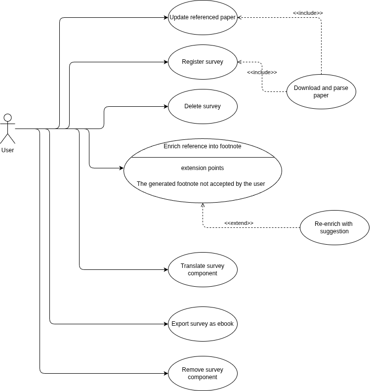
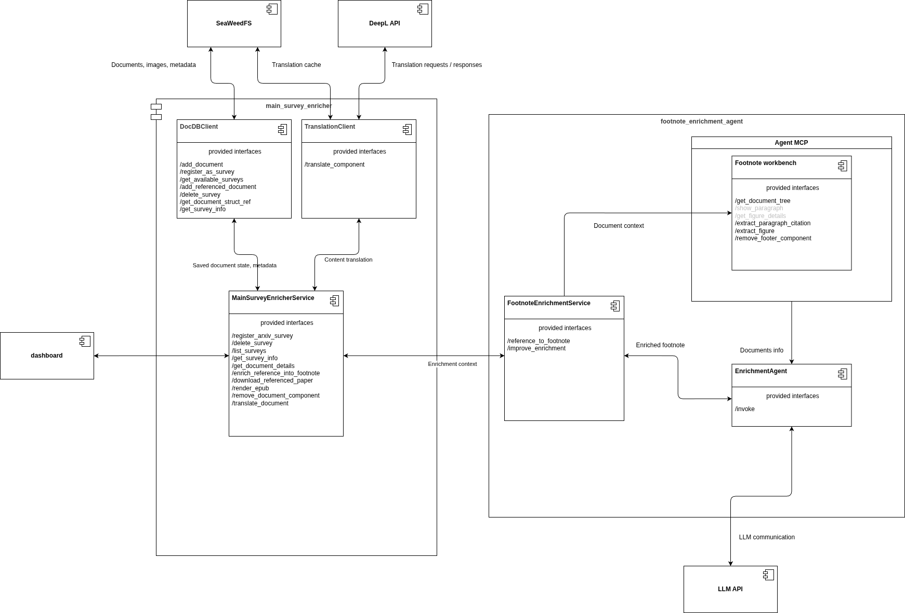

# paper-enrichment-agent

Paper Enrichment Agent is a tool designed to convert arXiv survey papers into full-fledged textbooks. Consider the following problem:

You want to read up on a chosen topic, such as "Paragraph Text-to-Speech synthesis", and you find a relevant survey paper on arXiv. However, most paragraphs take the form:

```
... Multiple works attempt to address the problem of lack of high quality paragraph data [1, 2, 3, 4]. In [5], the authors use context-extrapolation and generative context-enrichment techniques to train on single-sentence data. The authors of [6] build a single-sentence model, conditioned on GST-based [7] and BERT-based [8] embeddings, that leverages a mixture attention mask.
```

You realize that you are unlikely to grasp the topic fully without additional context, background information, and examples. This is where Paper Enrichment Agent comes in:

- The paper is parsed and converted into ebook format that is more reader-friendly and easier to navigate using a kindle-like device
- Each reference to a paper is automatically expanded into a context-aware citation that provides relevant quotes, figures and tables from the cited paper
- Each processed reference paper is effectively converted into a set of footnotes, which explain the context of the citation and provide additional background information

## Architecture

### Use case diagram



### Component / Data flow diagram



## Evaluation

### Footnote Enrichment Agent

### Eval setup

The evaluation is based on `mlflow` and its `pytest` plugin. The module hierarchy of the evaluation code is shown below: 

```yaml
tests/llm_eval:
    # Per-test-suite setup, including the definition of data samples, test cases and scorers.
    suites:
        test_footnote_enrichment:
            # Suite-specific setup - defines at least the experiment name.
            conftest.py
            # 
            data.py
            # Defines particular evaluators of the traces produced for each data sample.
            # This is the place where the LLM Judges should be placed as well.
            scorers.py
            # Defines the test cases - including the Judge LLM calibration.
            test_footnote_enrichment.py
        ...
# Configuration of the entire evaluation pipeline - should contain per-suite configuration and global config, such as MLFlow
# server URI, Judge LLM parameters etc.
cfg.yaml
# Global evaluation setup - the module docstring defines how each test suite should be structured.
conftest.py
# Core evaluation utilities.
core.py
# Entrypoint script that loads config and runs evaluation.
run_eval.py
```

A single suite is supposed to correspond with a single MLFlow experiment. A single process run is meant to correspond with a single MLFlow run, therefore only one suite is allowed to be run at once. 

## Changelog

The changes are provided in the [CHANGELOG.md](CHANGELOG.md) file.
